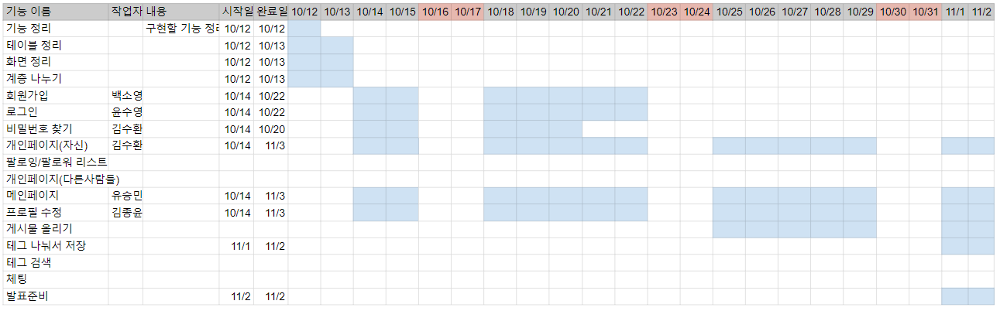
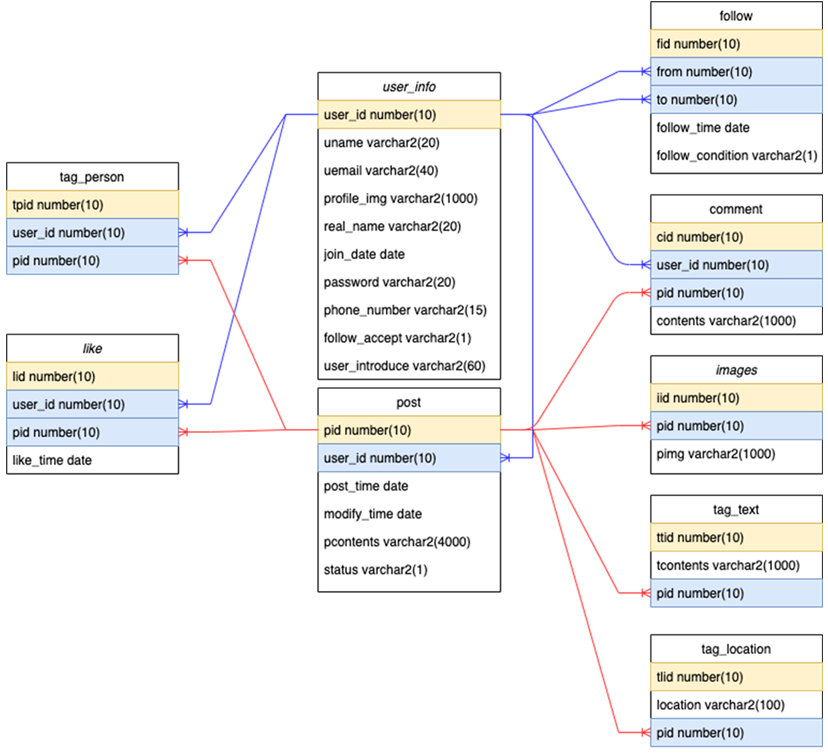
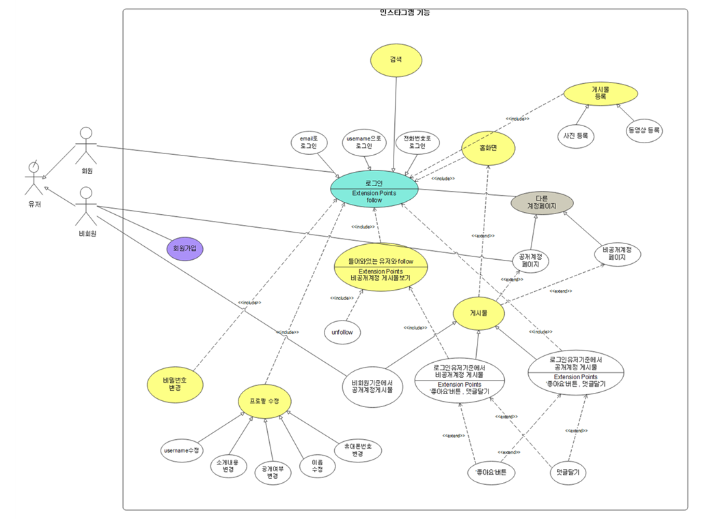
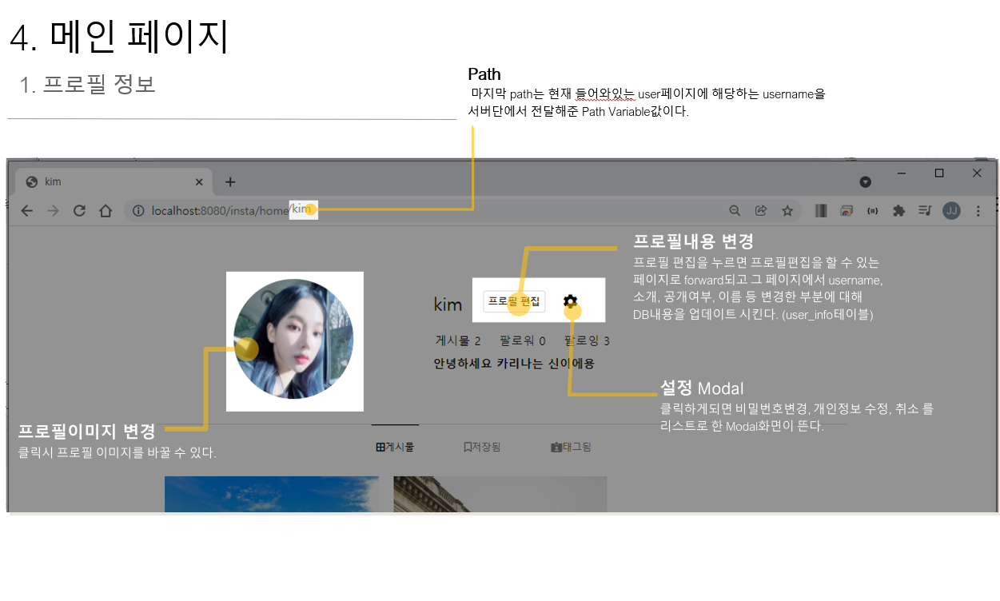
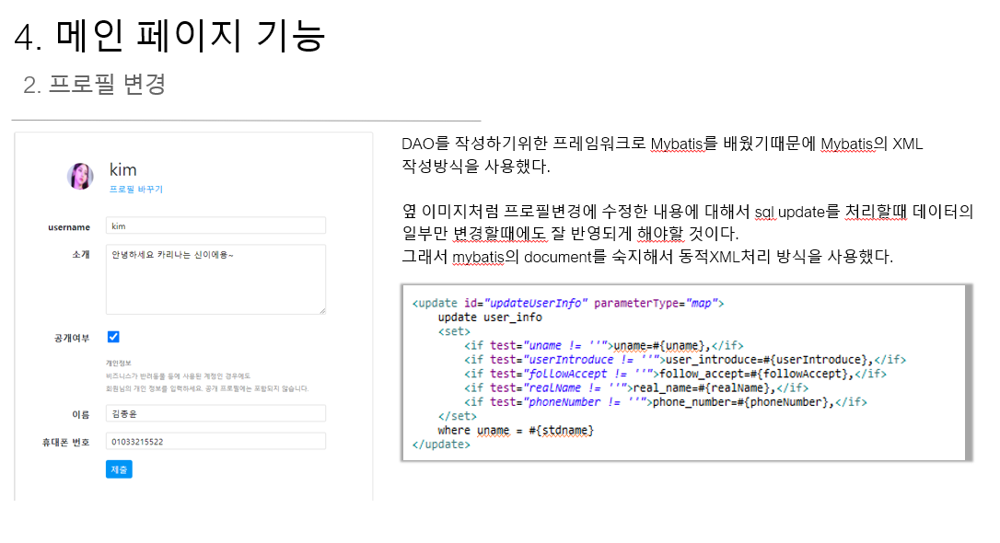
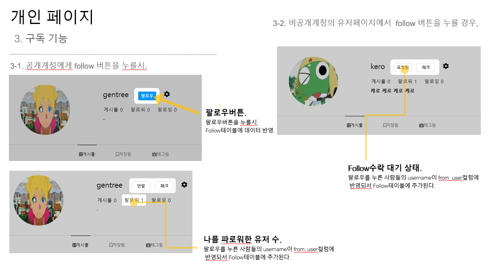
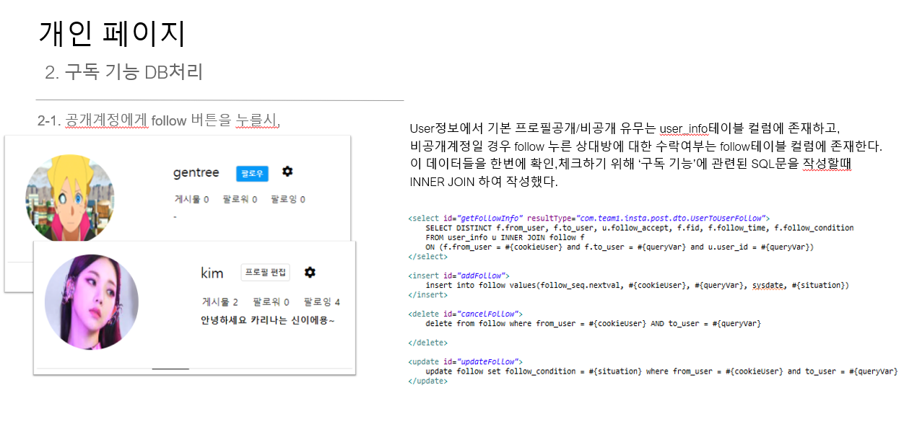

## 인별그램

---

​	우리가 익히 알고 있는 개인페이지를 꾸미며 이미지 공유 중심의 소셜미디어 서비스인 인스타그램의 내용입니다.                                                                           원래는 괜찮은 서비스가 될만한 소재를 제시해서 만들려고 했습니다. 하지만 저희 팀이 가진 지식을 기준으로 적용할 수 있는 주제의 포맷이 기존에 많은 사람들이 거쳐가는 주제들에서 크게 벗어나지않다고 판단하여 이미 잘 만들어져 있는 인스타그램의 기능을 직접 구현할수만 있다면 충분히 역량을 기르는것에 도움이 될것이라고 판단하여서 인스타그램 의 기능을 본따서 프론트개발과 백앤드개발을 따로 나누지않고 맡은 부분에 대해서 각자 풀스택으로 개발을  진행했습니다.

시연 영상:  https://www.youtube.com/watch?v=P4fPDedM7JE&list=PLvceeUENoEJP_KDwIU3bKnQCo1vHEihRP&index=1

## 브랜치 전략

----

git flow전략에 근거해서 진행했습니다. 처음에 develop브랜치에서 기능에 따라 feature브랜치들을 나누었고 중간에 개발과정을 취합하는 과정에서 devlop브랜치에 merge를 해주고 다시 새로운 feature브랜치를 만드는 전략과 commit메시지의 규칙도 정하면서 진행해보게 됐습니다. 

## 간트 차트

--------

## 사용된 기술

----

1. DB
   + 오라클 DB
2. 백엔드 
   + JAVA + 스프링 프레임워크
   + myBATIS
   + JSP
   + TOMCAT 8.0

3. 프론트엔드
   + HTML
   + CSS , 부트스트랩
   + JS

## ER다이어그램

----

 

## 유스케이스 다이어그램

---

## 내가 맡은(김종윤) 개발 부분

---

  

